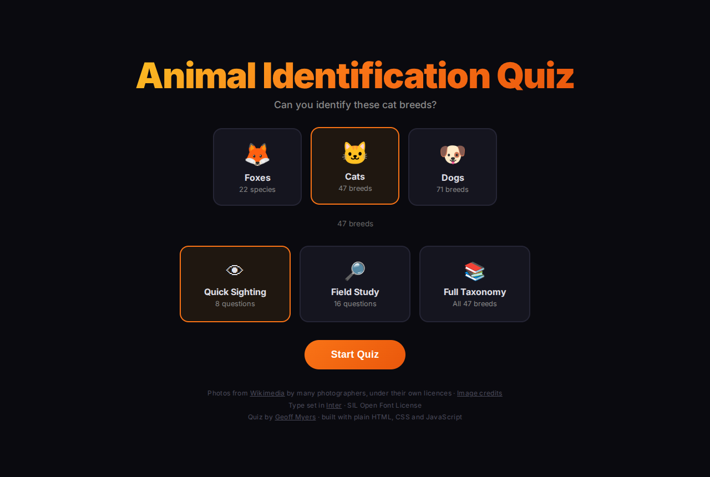
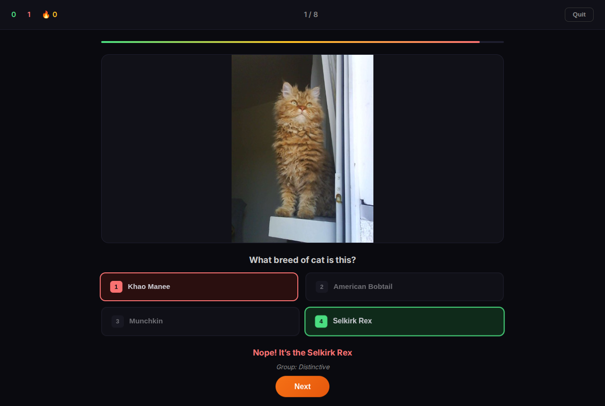
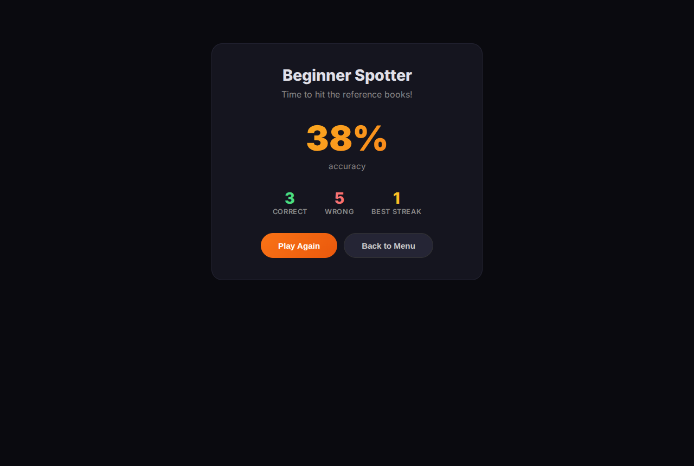
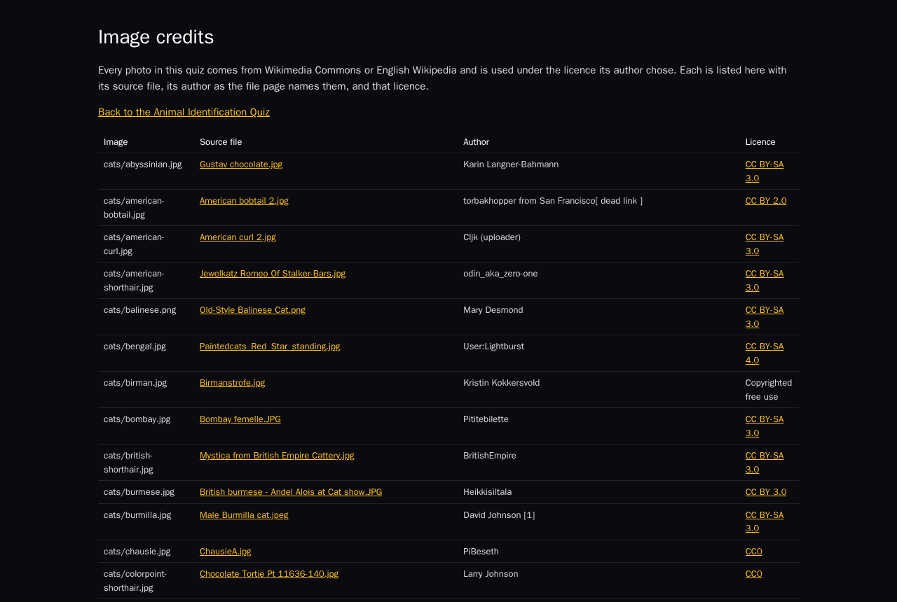

<p align="center">
  
</p>

# Animal Identification Quiz

<!-- BADGES:START -->


[](LICENSE.md)
[](CONTRIBUTING.md)
<!-- BADGES:END -->

## Table of Contents

- [Description](#description)
- [Screenshots](#screenshots)
- [Features](#features)
- [Requirements](#requirements)
- [Installation](#installation)
- [Usage](#usage)
- [Image credits](#image-credits)
- [Deployment](#deployment)
- [Architecture](#architecture)
- [Credits](#credits)
- [Contributing](#contributing)
- [License](#license)

## Description

A quick-fire quiz: a photo appears, and you pick which fox species, cat breed or
dog breed it shows from four choices before a 15-second timer runs out. The
wrong answers are chosen to be hard — from the same genus or breed group where
possible.

There are 22 fox-like canids, 47 cat breeds and 71 dog breeds, each with a photo
from Wikimedia and a credit naming its author and licence. The site is plain
HTML, CSS and JavaScript with no build step, and runs live at
[animal-quiz.geoffmyers.com](https://animal-quiz.geoffmyers.com).

## Screenshots

<p align="center">
  
  
</p>

<p align="center">
  
  
</p>

<p align="center"><em>The start screen, an answered question, the results, and the image credits page.</em></p>

## Features

- **Three categories:** 22 foxes and other fox-like canids (with scientific name
  and genus shown after each answer), 47 cat breeds and 71 dog breeds (with
  their breed group).
- **Three lengths:** Quick Sighting (8 questions), Field Study (16) and Full
  Taxonomy (every animal in the category).
- **Hard distractors:** the three wrong choices come from the same genus or
  group when it has enough members, then from the names closest in spelling.
- **A 15-second timer** per question, a running score and streak, and a ranked
  result from *Beginner Spotter* to *Master Naturalist*.
- **Keyboard play:** <kbd>1</kbd>–<kbd>4</kbd> to answer, <kbd>Enter</kbd> or
  <kbd>Space</kbd> for the next question. After an answer the quiz also moves on
  by itself after a second.
- **Credited images:** every photo's source file, author and licence is listed
  on a credits page linked from the start screen.

## Requirements

- Any current browser.
- To serve it locally: any static file server, for example Python 3.
- To regenerate the credits page: Python 3.9 or later.
- To fetch images with `generate-data.js`: Node.js 18 or later.
- To deploy it as the author does: a Cloudflare account and
  [Wrangler](https://developers.cloudflare.com/workers/wrangler/) 4.

## Installation

```bash
git clone https://github.com/geoffmyers/animal-quiz.git
cd animal-quiz
python3 -m http.server 8000
```

Then open <http://localhost:8000>. The quiz can also load from `file://` in
browsers that allow local file requests, but a server is more reliable.

## Usage

1. Choose a category: **Foxes**, **Cats** or **Dogs**.
2. Choose a length, then press **Start Quiz** (or <kbd>Enter</kbd>).
3. Pick an answer before the bar at the top runs out. The right answer turns
   green, and a wrong pick turns red.
4. **Quit** ends the quiz early and shows the results so far.

## Image credits

Every image is somebody's work, used under its own licence: mostly Creative
Commons licences that require the author to be named, plus public-domain, CC0
and free-use images, and one each under the GPL and the Free Art License.

- `data/image-credits.json` records each image's source file, author, licence
  and how the source was established.
- [CREDITS.md](CREDITS.md) and `credits.html` (linked from the start screen) are
  generated from it:

  ```bash
  python3 tools/render-credits.py
  ```

  The script refuses to run if any image in `images/` has no credit.

Each source was proved, not guessed: by the file's SHA-1 on Wikimedia, by
comparing pixels with Wikimedia's rendering of the candidate file, or, for two
re-edited files, by eye. Four images whose source could not be proved were
replaced with the current lead images of their Wikipedia articles, recorded as
they were downloaded; one of them had shown a Bengal *tiger* for the Bengal
cat.

`generate-data.js` downloads images from Wikipedia articles but records nothing
about their authors or licences. An image it fetches must be added to
`data/image-credits.json` before it is published.

## Deployment

The site is deployed as a [Cloudflare Worker with static
assets](https://developers.cloudflare.com/workers/static-assets/). The
repository root is the asset directory:

- `wrangler.toml` names the Worker and its custom domain. Both are the author's:
  change `name`, `account_id` and `routes` before deploying your own copy.
- `_headers` sets the Content-Security-Policy and other security headers.
- `.assetsignore` keeps `generate-data.js`, `tools/` and the repository docs
  from being served.

```bash
npx wrangler@4 deploy
```

## Architecture

| Path | Role |
|---|---|
| `index.html` | The three screens: start, quiz and results |
| `quiz.js` | Category settings, question building, timer, scoring and keyboard handling |
| `styles.css` | Styles |
| `data/foxes.json`, `data/cats.json`, `data/dogs.json` | Each animal's name, scientific name, image file and group |
| `images/` | One image per animal, by category |
| `data/image-credits.json`, `CREDITS.md`, `credits.html` | Image credits, and the two views generated from them |
| `tools/render-credits.py` | Generates `CREDITS.md` and `credits.html` |
| `generate-data.js` | Downloads images and writes the data files (Node.js) |
| `_headers`, `wrangler.toml`, `.assetsignore` | Cloudflare deployment |
| `docs/` | README icon and screenshots |

See [ARCHITECTURE.md](ARCHITECTURE.md) for how a quiz is put together.

## Credits

- Photos from [Wikimedia Commons](https://commons.wikimedia.org/) and English
  Wikipedia, by the photographers named in [CREDITS.md](CREDITS.md), under the
  licences listed there.
- Set in [Inter](https://fonts.google.com/specimen/Inter), served by Google
  Fonts under the SIL Open Font License.
- The README icon is the [Font Awesome](https://fontawesome.com/) `paw` glyph,
  as shown for this app on [geoffmyers.com](https://www.geoffmyers.com), used under
  [CC BY 4.0](https://creativecommons.org/licenses/by/4.0/).

Written by Geoff Myers ([geoffmyers.com](https://www.geoffmyers.com)).

## Contributing

Bug reports and pull requests are welcome. See [CONTRIBUTING.md](CONTRIBUTING.md)
for setup, checks and how this repository is published.

## License

This program is free software: you can redistribute it and/or modify it under
the terms of the GNU General Public License as published by the Free Software
Foundation, either version 3 of the License, or (at your option) any later
version.

This program is distributed in the hope that it will be useful, but WITHOUT ANY
WARRANTY; without even the implied warranty of MERCHANTABILITY or FITNESS FOR A
PARTICULAR PURPOSE. See [LICENSE.md](LICENSE.md) for the full text of the GNU
General Public License.

SPDX-License-Identifier: `GPL-3.0-or-later`
